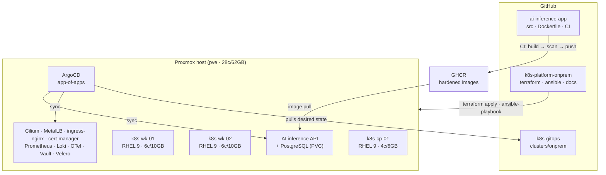
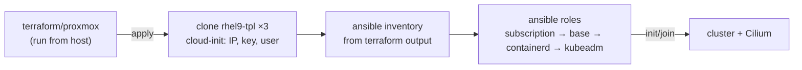
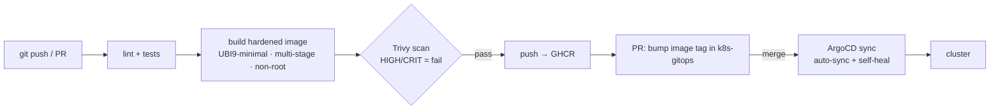

# On-Prem Kubernetes Platform — Architecture

> RHEL 9 kubeadm cluster on Proxmox, provisioned by Terraform and configured by Ansible,
> carrying an AI inference service behind a security-gated CI/CD pipeline.
>
> Status: **v1.0 frozen** · 2026-08-08 · decisions recorded in [`docs/adr/`](adr/) ·
> delivery plan in [`docs/phases/roadmap.md`](phases/roadmap.md)

## Goals

- A production-shaped platform exercising the target stack end to end
  (coverage matrix below), built and operated as a real team would.
- Hands-on alignment with CKA (kubeadm), RHCSA (RHEL 9 admin).
- Shift-left security in CI: hardened image, Trivy, IaC scanning, secret scanning.
- Every layer failure-tested: staged incidents with postmortems in
  [`docs/incidents/`](incidents/).

**Non-goals (for now):** production SLAs / HA control plane, OpenShift (separate lab
later), GPU inference.

## Repos

Split by lifecycle, not by technology — infra changes, desired state, and app code
evolve at different speeds with different reviewers (ADR-0004):

| Repo | Owns | Changes when |
|---|---|---|
| [`k8s-platform-onprem`](https://github.com/zakaria-statistics/k8s-platform-onprem) | Terraform (Proxmox), Ansible, docs/ADRs/incidents | infra or platform design changes |
| [`k8s-gitops`](https://github.com/zakaria-statistics/k8s-gitops) | ArgoCD desired state — `clusters/onprem/{bootstrap,platform,apps}` | anything deployed changes |
| [`ai-inference-app`](https://github.com/zakaria-statistics/ai-inference-app) | FastAPI service, hardened image, app CI | the workload changes |

## System overview

Git is the hub: this repo acts downward on the infrastructure, the app repo feeds the
pipeline, and ArgoCD — pulling from `k8s-gitops` — is the only thing that deploys.

## Environment inventory (verified 2026-08-07)

| Item | State | Consequence |
|---|---|---|
| Proxmox host | PVE 9.1.4 · 28 cores · 62 GB RAM (~49 GB free) | Room for 3-node cluster (26 GB) |
| Storage | `local` at 92% · `tank-vms` ZFS ~850 GB free | All VM disks on `tank-vms`, never `local` |
| LAN | vmbr0 static · host 192.168.11.50/24 · gw .1 | Addressing plan below |
| Tooling | Terraform 1.14.3 · Ansible 2.19.4 | No installs to start |
| Red Hat account | **TBD** | Needed for RHEL 9 dev subscription before Phase 1 |
| Public domain | **TBD** | Without: internal CA everywhere; decided in phase-2 design |

## Cluster design (Phases 1–2)

| Node | Role | vCPU | RAM | Disk (tank-vms) |
|---|---|---|---|---|
| rhel9-tpl | cloud-init template | — | — | 10 GB |
| k8s-cp-01 | control plane | 4 | 6 GB | 40 GB |
| k8s-wk-01 | worker | 6 | 10 GB | 60 GB |
| k8s-wk-02 | worker | 6 | 10 GB | 60 GB |

- **Provisioning:** Terraform + Proxmox provider clones the RHEL 9 cloud-init template
  (static IP, SSH key, user). One `terraform apply` = full cluster hardware.
- **Configuration:** Ansible roles from Terraform-generated inventory:
  `subscription-manager` → RHEL baseline (chrony, firewalld, kernel modules, swap off)
  → containerd → kubeadm init/join. **Firewalld and SELinux stay on** — configuring
  around them properly is the RHCSA-grade skill.
- **CNI:** Cilium (kube-proxy-less, eBPF, Hubble). See ADR-0003.
- **Storage:** NFS StorageClass backed by an export from `tank-data`.
- **Database:** PostgreSQL **in-cluster** (StatefulSet + PVC) — on-prem there is no
  managed option, so we own backups, HA, and upgrades. That ownership is the point.

### Provisioning flow

Rebuild-over-repair: empty host → joined cluster is two commands, so a broken node gets
destroyed and re-created, never hand-fixed.

## The edge — a concept ladder

Traffic handling is built in deliberate steps, each with an ADR explaining why the
previous rung wasn't enough:

1. **Reverse proxy** — TLS termination in front of one backend.
2. **L4 load balancing** — MetalLB L2 (pool `.70–.79`): a VIP that survives node failure.
3. **L7 ingress** — ingress-nginx at VIP `.70`: host/path routing, TLS via cert-manager.
4. **API gateway** — (later rung) authn, rate limiting, versioned APIs; pick recorded
   in its phase design.

Request path once the ladder is climbed: client (`app.lab` → `.70` hosts entry) →
MetalLB L2 announce → ingress-nginx (TLS termination, internal CA) → Service → Pod
(Cilium eBPF). Default-deny NetworkPolicy per app namespace.

### Network & addressing plan

| Address | Assignment |
|---|---|
| 192.168.11.1 | Router / gateway (existing) |
| 192.168.11.50 | Proxmox host — vmbr0, NFS export from `tank-data` |
| 192.168.11.60–62 | k8s-cp-01, k8s-wk-01, k8s-wk-02 (cloud-init static) |
| 192.168.11.70–79 | MetalLB pool; `.70` = ingress-nginx VIP |
| 10.244.0.0/16 | Pod network (Cilium) |
| 10.96.0.0/12 | Service network (kubeadm default) |

> **Check before Phase 1:** confirm the router's DHCP scope excludes `.60–.79`.

## CI/CD — the security story

Nothing deploys from CI. CI only updates git; ArgoCD does the deploying.

### Who runs where

| Workflow | Runs on | Does | Why there |
|---|---|---|---|
| App CI | GitHub-hosted runner | lint · test · build · Trivy · push · bump-PR | needs only GitHub + GHCR |
| Platform CI (PR) | GitHub-hosted runner | fmt/validate · tfsec · Checkov · gitleaks | static analysis, no LAN needed |
| GitOps CI (PR) | GitHub-hosted runner | gitleaks · manifest validation | static analysis |
| Platform apply | Proxmox host, by hand | `terraform apply` · `ansible-playbook` | only place with LAN + token access |
| Deploy | ArgoCD, in-cluster | pulls `k8s-gitops` and syncs | pull model — nothing pushes into the cluster |

GitHub-hosted runners have **no route to the LAN** — that constraint shapes the split
(ADR-0005). Deferred upgrade: self-hosted runner (LXC) for applies.

### Hardened image

- Base `registry.access.redhat.com/ubi9/ubi-minimal`, multi-stage, non-root, pinned digests.
- Gates: Trivy (image), tfsec/Checkov (IaC), gitleaks (secrets); stretch: cosign sign + verify.

### The workload

FastAPI inference service (small CPU model baked into the image) + PostgreSQL on a PVC.
The DB endpoint reaches the app **only via config** (env injected from the gitops
overlay) — the app never hardcodes where its database lives.

## Backup & restore

Velero with Kopia file-level backup (NFS has no snapshots — documented trade-off,
acceptable at this data size). Restore is drilled, not assumed: see the incident track.

## Incident track

Every phase ends with staged incidents — break it for real, fix it for real, write a
one-page postmortem (impact, timeline, root cause, fix, prevention) in
[`docs/incidents/`](incidents/). Planned drills per phase are listed in the
[roadmap](phases/roadmap.md). These are honest chaos drills on our own platform, and
they are the "tell me about an incident" answers.

## Stack coverage

| Lane | Item | Where |
|---|---|---|
| fundamental | RedHat Linux | every node is RHEL 9; Ansible does the admin |
| fundamental | Networking | static IPs, bridge, MetalLB L2, Cilium, NetworkPolicy |
| fundamental | TLS/SSL | own CA via cert-manager; renewal failure drill |
| fundamental | Reverse proxy / LB / gateway | the edge ladder, one rung per ADR |
| fundamental | GitFlow | branching model on all repos, PR-only main |
| fundamental | Python/Bash | FastAPI service; CI and host glue |
| concept | GitOps | ArgoCD app-of-apps, git as only deploy path |
| concept | Immutable infra | template + rebuild over in-place repair |
| concept | Shift-left security | gitleaks/Trivy/tfsec gates pre-merge |
| concept | Observability | metrics + logs + traces, one Grafana pane |
| concept | Incident response | staged drills + postmortems every phase |
| tool | Kubernetes/kubeadm | built by hand — the CKA muscle |
| tool | Terraform | Proxmox provider |
| tool | Ansible | all node config, inventory from Terraform |
| tool | Helm + ArgoCD | app chart + platform charts |
| tool | Docker | hardened multi-stage UBI9 build |
| tool | GitHub Actions | all three CI workflows |
| tool | Vault | secrets phase, with ESO |
| tool | Prometheus/Grafana/Loki/OTel | observability phase |

Not covered here (deliberately): cloud providers (see roadmap — those decisions land
when they're made), OpenShift (separate lab), PowerShell (candidate for cloud scripting).

## Risks

- **Red Hat account** needed before Phase 1; fallback Rocky 9 with identical roles.
- **DHCP overlap** — confirm router scope excludes `.60–.79`.
- **Host contention** — sllm-lab (8 GB) shares the host; stop it if RAM gets tight.
- **Velero + NFS** — file-level backup, no snapshots; acceptable at this data size, documented trade-off.
