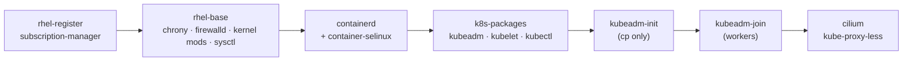

# Phase 1 — Ground: VMs to a running cluster

> Status: **design for review** · drafted 2026-08-08 · builds nothing until reviewed.
> Deliverable: `terraform apply` + one playbook = 3 RHEL 9 nodes running Kubernetes
> with Cilium, rebuildable from empty. Closes with tag **v1.0**.

## Inputs (verified present)

- RHEL 9.8 KVM guest image at `/tank/iso/rhel-9.8-x86_64-kvm.qcow2` (qcow2 verified;
  sha256 `b99091f1…48a7e4e` — cross-check against portal pending).
- Proxmox host `pve` 9.1.4, VM storage `tank-vms`, bridge `vmbr0` (192.168.11.0/24).
- Red Hat subscription active (trial; switch to Developer Subscription before expiry).
- **Gate:** router DHCP scope confirmed to exclude `.60–.79` (Phase 0 leftover).
  LAN sweep 2026-08-08: all DHCP clients sit at `.100+`; `.60` was occupied by the
  pre-existing sllm-lab VM — moved to `.90` the same day, block is clean.

## Design

### 1 · Template (one-time, scripted)

VM **9100 `rhel9-tpl`** (9000 is taken by an existing ubuntu template on this host):
import the qcow2 as a virtio-scsi disk, add cloud-init drive,
serial console, qemu-guest-agent enabled; convert to template. The template stays
**unregistered** — clones get identity at first boot. Scripted in
`terraform/proxmox/scripts/build-template.sh` (qm commands), documented, idempotent.

### 2 · Terraform — machine existence (ADR-0002)

Provider: **`bpg/proxmox`** (maintained, first-class cloud-init support; the older
Telmate provider is stale — recorded as ADR-0007). Auth: Proxmox API token, supplied
via environment (`TF_VAR_`), never in files. State: local on the host (revisit when a
second operator exists).

| VM | ID | vCPU | RAM | Disk | IP (cloud-init) |
|---|---|---|---|---|---|
| k8s-cp-01 | 9101 | 4 | 6 GB | 40 GB | 192.168.11.60/24 gw .1 |
| k8s-wk-01 | 9102 | 6 | 10 GB | 60 GB | 192.168.11.61/24 gw .1 |
| k8s-wk-02 | 9103 | 6 | 10 GB | 60 GB | 192.168.11.62/24 gw .1 |

Cloud-init: user `k8s` + fresh ed25519 keypair generated for this project (private key
stays on the host, outside the repo), DNS = router. A `local_file` output renders
`ansible/inventory/hosts.yaml` — the Terraform→Ansible handoff.

### 3 · Ansible — machine state (ADR-0002)

One playbook `site.yaml`, roles in order:

- **rhel-register:** `subscription-manager register` (credentials via Ansible Vault),
  attach, enable BaseOS + AppStream.
- **rhel-base:** chrony; **firewalld stays on** — explicit ports: cp `6443, 2379-2380,
  10250, 10257, 10259`; workers `10250`; both: Cilium health `4240`, VXLAN `8472/udp`,
  Hubble `4244`. **SELinux stays enforcing.** Kernel modules `overlay`, `br_netfilter`;
  sysctl ip_forward; swap off (guest image ships without — verified during build).
- **containerd:** from Docker's repo, `SystemdCgroup = true`, with `container-selinux`.
- **k8s-packages:** kubeadm/kubelet/kubectl from `pkgs.k8s.io` (latest stable minor,
  pinned in one variable), versionlock.
- **kubeadm-init:** pod CIDR `10.244.0.0/16`, service CIDR `10.96.0.0/12`,
  `skip-phases=addon/kube-proxy` (Cilium replaces it). Join token → workers.
- **cilium:** Helm install — kube-proxy replacement on, Hubble + relay + UI on.

### 4 · Cilium validation gate (ADR-0003 risk)

Before declaring done: `cilium status --wait` green, `cilium connectivity test` passes
on the RHEL 9 kernel (5.14 + backports). If eBPF features are missing → fallback
ladder: Cilium with kube-proxy → Calico (decision recorded in ADR-0003 either way).

### 5 · Smoke test (exit proof)

`kubectl get nodes` all Ready · test deployment (nginx, 2 replicas) schedules on both
workers · ClusterIP reachable from a debug pod · default-deny NetworkPolicy blocks it ·
policy removed, traffic restored. No ingress/LB yet — that's Phase 2.

## Incident drills (close the phase)

1. **etcd loss & restore** — `etcdctl snapshot save`, then destroy etcd data on cp;
   restore from snapshot; cluster state (test deployment) survives. Postmortem
   `docs/incidents/2026-xx-etcd-restore.md`.
2. **Worker power-off under load** — hard-stop a worker while the test deployment runs;
   observe eviction/rescheduling timings; document PDB implications. Postmortem
   `docs/incidents/2026-xx-worker-loss.md`.

## Repo mechanics

Work on `feature/phase-1-ground` → PRs into `dev` (terraform gates go live on first
`.tf` file — fmt/validate/tfsec/Checkov must pass) → phase closes by PR `dev → main`
+ tag `v1.0`.

## Exit criteria

- [ ] `build-template.sh` + `terraform apply` + `site.yaml` from empty host → 3-node cluster, repeatable after full destroy
- [ ] All nodes `Ready`, firewalld on, SELinux `Enforcing`
- [ ] Cilium green, kube-proxy-less, connectivity test passed
- [ ] Smoke test + NetworkPolicy check passed
- [ ] Both incident drills done, postmortems merged
- [ ] CI green with terraform gates now active · tag **v1.0**

## Out of scope

MetalLB, ingress, cert-manager, NFS StorageClass (Phase 2) · any workload beyond the
smoke test (Phase 3) · observability (Phase 5).

## Open questions for review

1. Kubernetes version: pin latest stable (1.34.x at time of build) or n-1 for maximal
   docs/tooling compatibility? *(default: latest stable)*
2. Cluster API endpoint: raw IP `.60` or a hosts-entry name like `k8s-api.lab` baked
   into kubeadm's cert SANs from day 1? *(default: name + SAN — free now, saves pain
   if the endpoint ever moves)*
3. Drill timing: run both drills before tagging v1.0 (as designed), or tag first and
   drill after? *(default: drills gate the tag)*
